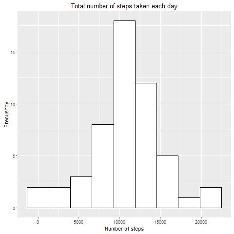

## Loading and preprocessing the data

Load date into bd  and transform interval variable in appropiated format, it´s transformed in date class.

```{r}
bd <- read.csv("data/activity.csv", stringsAsFactors = FALSE)

bd$date <- as.Date(bd$date)
```

You need to load the following packages:
```{r, echo=FALSE}
library(dplyr)
library(ggplot2)
```

## What is mean total number of steps taken per day?

I calculate the total number of steps taken per day into bd1, the follow  
code do it:
```{r}
#library(dplyr) For calculate the total number of steps by day

bd1 <- group_by(bd, date) %>% summarize(total_numbers_steps=sum(steps))
bd1 <- as.data.frame(bd1)
```

The Histogram of the total number of steps taken each day is produced by the follow code:
```{r}
#library(ggplot2) My favorite plot system
ggplot(bd1, aes(total_numbers_steps)) + geom_histogram(bins = 9, fill="white",
                                                       colour="black") +
        ggtitle("Total number of steps taken each day") +
        ylab("Frecuency") + xlab("Number of steps")


```

and the histogram is




Mean and median of the total number of steps taken per day is produced by this code:
```{r}
#You need load dplyr package

bd2 <- summarize(bd1,mean_total = mean(total_numbers_steps, na.rm = TRUE), median_total = median(total_numbers_steps, na.rm = TRUE))
bd2 <- as.data.frame(bd2)
mean <- bd2[1]
median <- bd2[2]
```

And the mean and median of the total number of steps taken per day is **`r mean`** and **`r median`** respectively.

## What is the average daily activity pattern?


## Imputing missing values


## Are there differences in activity patterns between weekdays and weekends?
