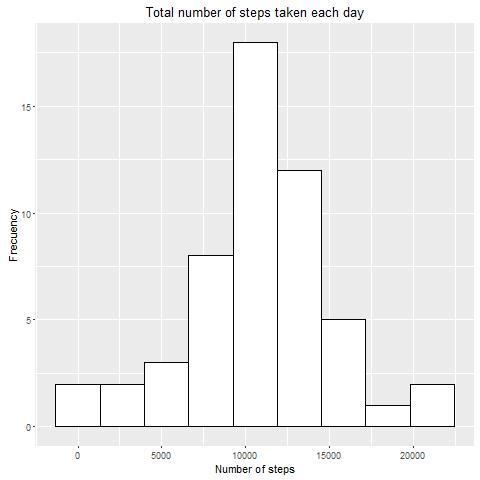
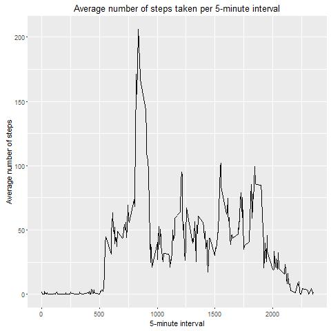
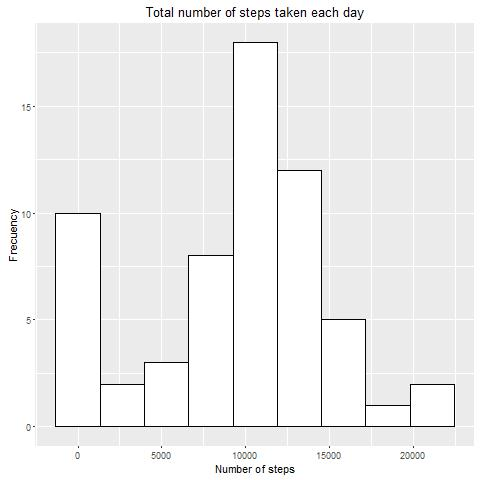
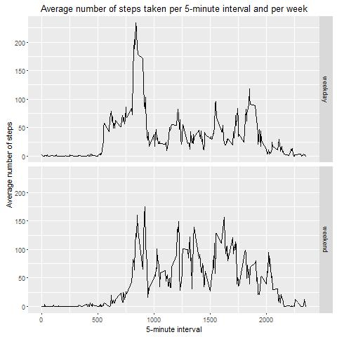

## Loading and preprocessing the data

Load date into bd  and transform interval variable in appropiated format, it압 transformed in date class.

```{r}
bd <- read.csv("data/activity.csv", stringsAsFactors = FALSE)

bd$date <- as.Date(bd$date)
```

You need to load the following packages:
```{r, echo=FALSE}
library(dplyr)
library(ggplot2)
```

## What is mean total number of steps taken per day?

I calculate the total number of steps taken per day into bd1, the follow  
code do it:
```{r}
#library(dplyr) For calculate the total number of steps by day

bd1 <- group_by(bd, date) %>% summarize(total_numbers_steps=sum(steps))
bd1 <- as.data.frame(bd1)
```

The Histogram of the total number of steps taken each day is produced by the follow code:
```{r}
#library(ggplot2) My favorite plot system
plot1 <- ggplot(bd1, aes(total_numbers_steps)) + geom_histogram(bins = 9, fill="white",
                                                       colour="black") +
        ggtitle("Total number of steps taken each day") +
        ylab("Frecuency") + xlab("Number of steps")


```

and the histogram is




Mean and median of the total number of steps taken per day is produced by this code:
```{r}
#You need load dplyr package

bd2 <- summarize(bd1,mean_total = mean(total_numbers_steps, na.rm = TRUE), median_total = median(total_numbers_steps, na.rm = TRUE))
bd2 <- as.data.frame(bd2)
mean <- bd2[1]
median <- bd2[2]
```

And the mean and median of the total number of steps taken per day is **10766.19** and **10765** steps respectively.

## What is the average daily activity pattern?

The Time series plot of the 5-minute interval and the average number of steps taken, averaged across all days is produced by this code:

```{r}
#You need load dplyr and ggplot2 packages

bd3 <- group_by(bd, interval) %>% summarize(mean_steps_interval = mean(steps, na.rm = TRUE))
plot2 <- ggplot(bd3, aes(x=interval, y=mean_steps_interval)) + geom_line() +
        ggtitle("Average number of steps taken per 5-minute interval") +
        ylab("Average number of steps") + xlab("5-minute interval")

hig_num_steps<- bd3[which.max(bd3$mean_steps_interval),] #hig_num_steps object contains the following answer
        
```



**835** is 5-minute interval with the maximum average numbers of steps, it's iqual to  **206.1698** steps.


## Imputing missing values

```{r}
totNA <- sum(is.na(bd$steps)) #This code
#produces the follow answer
```

The total number of missin values is **2304**. This value is produced by the last code:


I devise a strategy for filling in all of the missing values in the dataset bd. The strategy was fill NA values with median number of steps taken per 5-minute interval because the mean is far from median. To achieve this objective, I have created fillNA function that allow filling missing values in bd data set and creating a new dataset that is equal to the original dataset but with the missing data filled in. The follow code show the strategy:

```{r}
#You need load dplyr and ggplot2 packages

#bd4 <- group_by(bd, interval) %>% summarize(mean_interval = mean(steps, na.rm=TRUE), median_interval = median(steps, na.rm = TRUE))

#Below plot show that there is a huge difference between mean and median, so
# in this case is better choose median.
#ggplot(bd4, aes(interval)) + geom_line(aes(y=mean_interval, colour="mean_interval")) + geom_line(aes(y=median_interval, colour="median_interval"))

#fillNA function allow fill missing values in bd data set. bd4 data set is so important to fillNA performance
fillNA <- function(dataset){
        bd4 <- group_by(bd, interval) %>% summarize(mean_interval = mean(steps, na.rm=TRUE), median_interval = median(steps, na.rm = TRUE))
        
        bd4 <- as.data.frame(bd4)
        
        for (i in 1:dim(dataset)[1]) {
        if(is.na(dataset$steps[i])){
                dataset$steps[i] <- bd4[bd4$interval==dataset$interval[i],3]
        }
        }
        dataset
}

#Copy the data without NA
bdfill <- fillNA(bd) 

```


Below the code that produce the histogram of the total number of steps taken each day with dataset without NA압

```{r}
#You need load dplyr and ggplot2 packages
bd5 <- group_by(bdfill, date) %>% summarize(total_numbers_steps = sum(steps))

plot3 <- ggplot(bd5, aes(total_numbers_steps)) + geom_histogram(bins = 9, fill="white",
                                                       colour="black") +
        ggtitle("Total number of steps taken each day") +
        ylab("Frecuency") + xlab("Number of steps")
        
```

The new histogram is:



Below the code that produce the Mean and median total number of steps taken per day with dataset without NA압

```{r}
bd6 <- summarize(bd5, mean_total = mean(total_numbers_steps),
                 median_total = median(total_numbers_steps))

meanFill <- bd6[1]
medianFill <- bd6[2]
```

The mean and median of the total number of steps taken per day with dataset without NA압 is **9503.869** and **10395** steps respectively. There is difference betweeen first and second part, specifically in the average. For the first part mean was **10766.19**, more than a thousand step difference, this reflect the importance of 0 steps in the distribuction.


## Are there differences in activity patterns between weekdays and weekends?

The follow code allows to create a new dataset with a new factor variable with two levels - "weekday" and "weekend" indicating whether a given date is a weekday or weekend day:

```{r}

newFactor <- function(dataset){
weekdays <- c("lunes", "martes", "mi本coles", "jueves", "viernes")
weekends <- c("s庚ado", "domingo")
dataset$week1 <- weekdays(dataset$date)

for (j in 1:dim(dataset)[1]) {
        if((dataset$week1[j] %in% weekdays) | dataset$week1[j] == "mi本coles"){
                dataset$week[j] <- "weekday"
        }else{
                dataset$week[j] <- "weekend"
        }
}
dataset
} #This function create new dataset with factor variable requested.

bd7 <- newFactor(bd)
        
```

The below code makes a panel plot containing a time series plot of the 5-minute interval (x-axis) and the average number of steps taken, averaged across all weekday days or weekend days (y-axis). 

```{r}
#You need load dplyr and ggplot2 packages
bd8 <-  group_by(bd7, interval, week) %>% summarize(mean_steps_interval = mean(steps, na.rm = TRUE))
plot4 <- ggplot(bd8, aes(x=interval, y=mean_steps_interval)) + geom_line() +
        facet_grid(week ~ .) +
        ggtitle("Average number of steps taken per 5-minute interval and per week") +
        ylab("Average number of steps") + xlab("5-minute interval")

```

This below plot show that the participant tended to stand in one place when they are working, so the average numbers of steps was lower than the average numbers of steps walked at weekends leisure.



